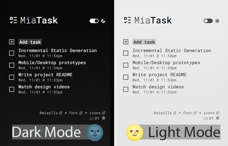
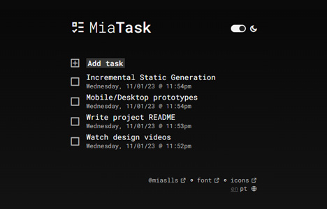
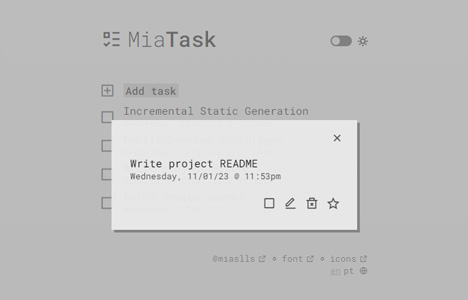

Essa página está em  Português.
To view this page in  English, [click here](./README.md).

---

#  MiaTask


Aplicativo de lista de tarefas simples e intuitivo onde você pode criar/atualizar/remover tarefas e também marcá-las como concluídas ✅ e/ou favoritadas ⭐.

## 🔗 Demo

- [miatask.vercel.app](https://miatask.vercel.app/pt)

## 🧮 Tecnologias / Dependências

- [React](https://react.dev/)
- [Next.js](https://nextjs.org/)
- [TypeScript](https://www.typescriptlang.org/)
- [Prisma](https://www.prisma.io/)
- [SWR](https://swr.vercel.app/)
- [react-hot-toast](https://react-hot-toast.com/)
- [next-translate](https://github.com/aralroca/next-translate)
- [iso-639-1](https://github.com/meikidd/iso-639-1)

## 💎 Features

Foco em recursos de acessibilidade (a11y)

### 📱 Responsividade

Projetado para usuários em qualquer dispositivo.

### 🌓 Modo Claro/Escuro

Tema definido automaticamente de acordo com a preferência do usuário, e pode ser configurados por meio de um botão na interface.

### 🌎 Internacionalização (i18n) e Localização (l10n)

O usuário é redirecionado para a versão mais apropriada da página de acordo com as preferências de idioma/localidade. O aplicativo atualmente suporta inglês e português brasileiro, com o primeiro sendo o idioma padrão. Os usuários podem usar um menu de navegação para ver outras opções de idioma.

### ⌨️ Navegação por Teclado

Todos os elementos são acessíveis por meio de navegação por teclado. Inclui o uso de [`useFocusTrapping`](src/hooks/useFocusTrapping.ts), uma funcionalidade que garante que os usuários de teclado possam navegar por elementos como modais e formulários sem o risco de ficarem presos.

### 🏷️ ARIA

Elementos interativos são rotulados com precisão para aumentar o acesso a todos os públicos.

## 🖼️ Screenshots







## ⚙️ Instalação

Clonar projeto

```bash
> git clone https://github.com/miaslls/MiaTask.git
```

Ir para pasta do projeto

```bash
> cd my-project
```

Instalar dependências

```bash
> npm install
```

Rodar o projeto

```bash
> npm run build start && npm run start
```

## 🌐 Referência da API

#### Criar tarefa

```http
POST /api/task
```

#### Obter todas as tarefas

```http
GET /api/task
```

#### Remover tarefa

```http
DELETE /api/task/[id]
```

#### Atualizar tarefa

```http
PATCH /api/task/[id]
```

#### Realizar ação

```http
PATCH /api/task/[id]/[action]
```

| Parameter | Type                   | Description                                            |
| :-------- | :--------------------- | :----------------------------------------------------- |
| `id`      | `string`               | **Required**. Id da tarefa                             |
| `action`  | `'complete' \| 'star'` | **Required**. Ação (completar/adicionar aos favoritos) |

## 👩‍💻 Autoria

- [@miaslls](https://github.com/miaslls)

## 🫶 Recursos / Agradecimentos

- [@rmobis](https://github.com/rmobis)
- [@acaua](https://github.com/acaua)
- [Remix Icon](https://remixicon.com/)
- [Roboto Mono](https://fonts.google.com/specimen/Roboto+Mono)
