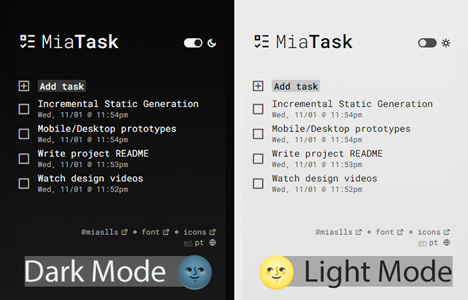
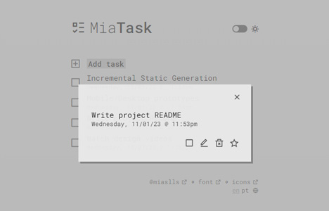

This page is in  English.
Para visualizar essa página em  Português, [clique aqui](./README-ptbr.md).

---

#  MiaTask


Simple and intuitive tasklist application where you can create / update / remove tasks, and also have them in a completed ✅ and/or starred ⭐ states.

## 🔗 Demo

- [miatask.vercel.app](https://miatask.vercel.app/)

## 🧮 Technologies / Dependencies

- [React](https://react.dev/)
- [Next.js](https://nextjs.org/)
- [TypeScript](https://www.typescriptlang.org/)
- [Prisma](https://www.prisma.io/)
- [SWR](https://swr.vercel.app/)
- [react-hot-toast](https://react-hot-toast.com/)
- [next-translate](https://github.com/aralroca/next-translate)
- [iso-639-1](https://github.com/meikidd/iso-639-1)

## 💎 Features

Focus on acessibility (a11y) features, such as:

### 📱 Responsiveness

Designed for users on any device.

### 🌓 Light/Dark mode

Theme automatically set to user preference through the use of media queries, or cookies which can be set through a toggle button on the interface.

### 🌎 Internationalization (i18n) & Localization (l10n)

User is redirected to most appropriate version of page according to locale/language preferences. Application currently supports English and Brazilian Portuguese, with the former being the default language. Users can use a navigation menu to view other language options.

### ⌨️ Keyboard navigation

All elements accessible through keyboard navigation. Includes [`useFocusTrapping`](src/hooks/useFocusTrapping.ts), a functionality that ensures keyboard users can smoothly navigate through elements such as modals and forms without the risk of getting trapped.

### 🏷️ ARIA

Interactive elements accurately titled and aria-labeled to increase access to all publics.

## 🖼️ Screenshots






## ⚙️ Install and Run

Clone the project

```bash
> git clone https://github.com/miaslls/MiaTask.git
```

Go to the project directory

```bash
> cd my-project
```

Install dependencies

```bash
> npm install
```

Run the project

```bash
> npm run build start && npm run start
```

## 🌐 API Reference

#### Create task

```http
POST /api/task
```

#### Get all tasks

```http
GET /api/task
```

#### Remove task

```http
DELETE /api/task/[id]
```

#### Update task

```http
PATCH /api/task/[id]
```

#### Toggle action

```http
PATCH /api/task/[id]/[action]
```

| Parameter | Type                   | Description                                       |
| :-------- | :--------------------- | :------------------------------------------------ |
| `id`      | `string`               | **Required**. Id of task to fetch                 |
| `action`  | `'complete' \| 'star'` | **Required**. Action to take (complete/star task) |

## 👩‍💻 Authors

- [@miaslls](https://github.com/miaslls)

## 🫶 Acknowledgements

- [@rmobis](https://github.com/rmobis)
- [@acaua](https://github.com/acaua)
- [Remix Icon](https://remixicon.com/)
- [Roboto Mono](https://fonts.google.com/specimen/Roboto+Mono)
